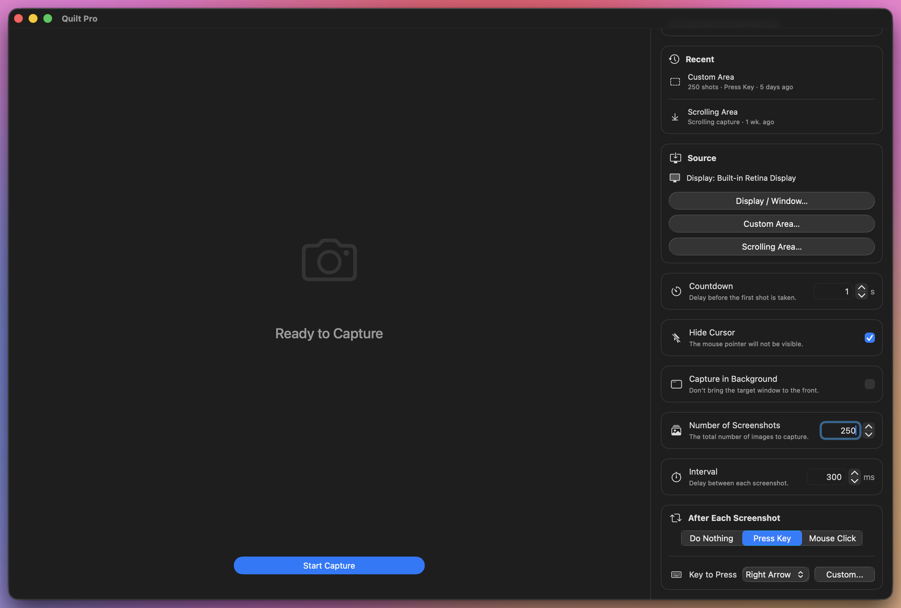
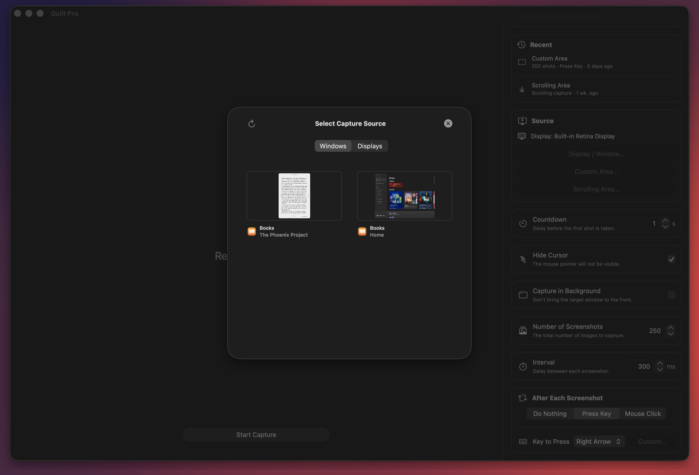
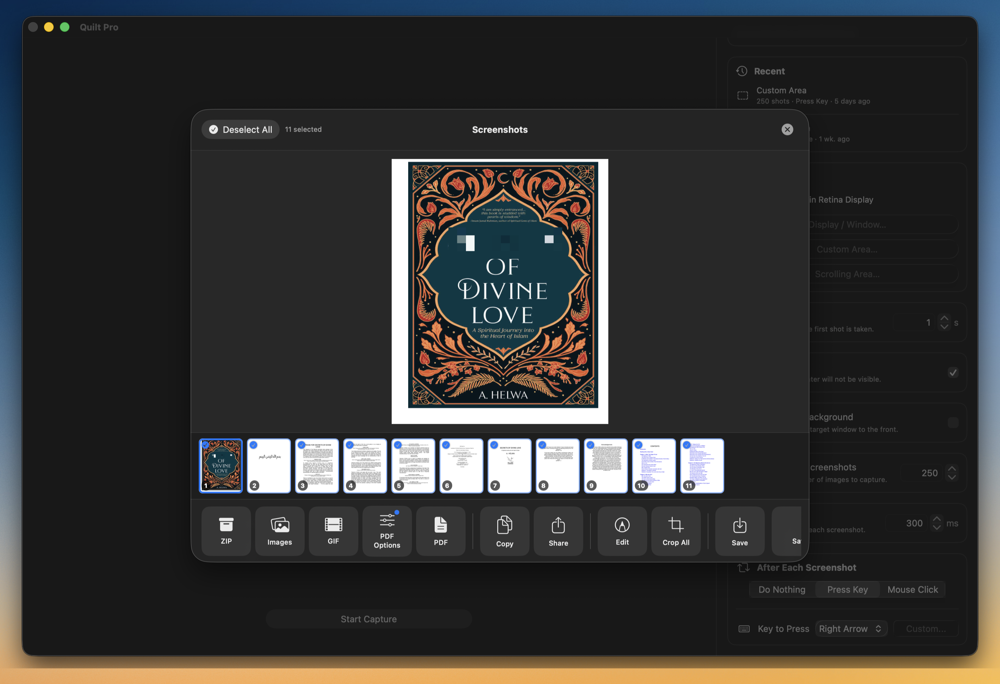
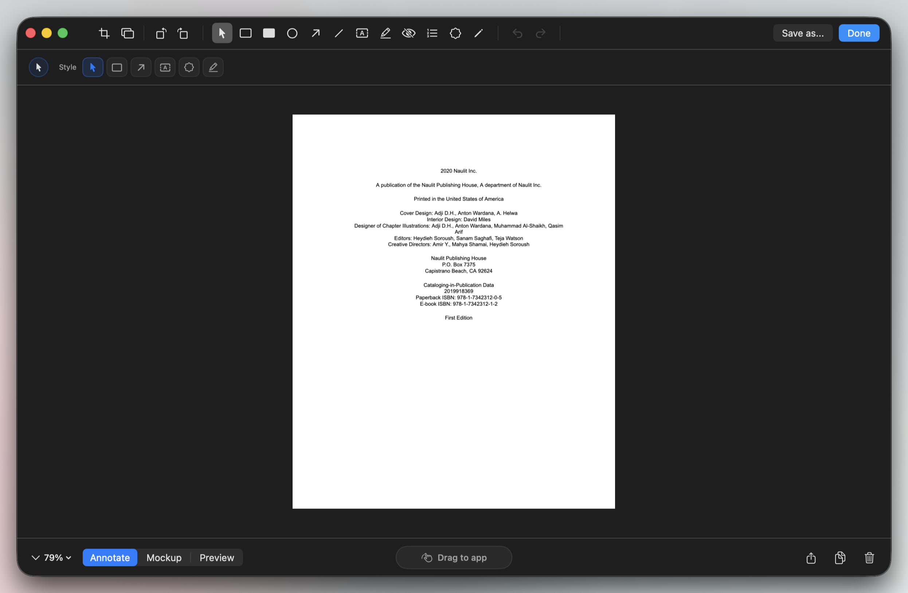
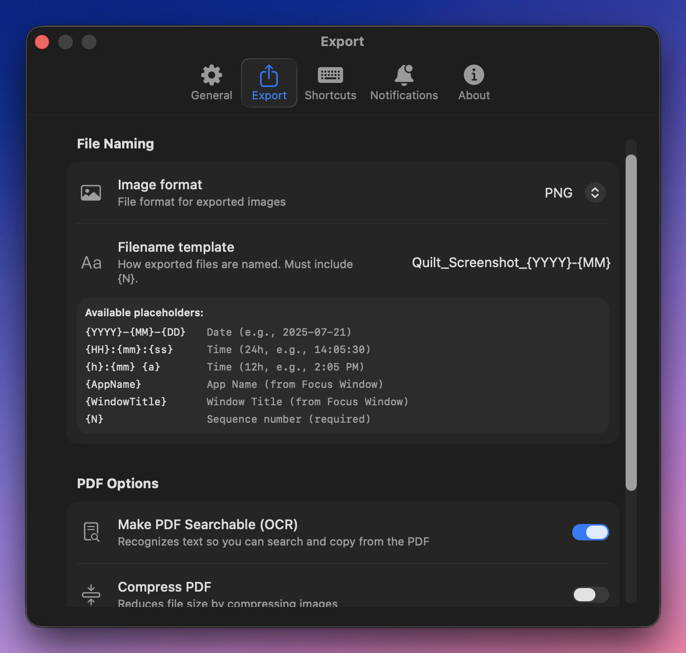

# Quilt for macOS

**The high-fidelity, local-first screen capture and document automation engine for macOS.**  
Intercept window coordinates, automate keystroke workflows, and recognize embedded text with a native app built to run completely offline. 
A privacy-safe utility for compiling screen layouts into text-searchable documentation, presentation assets, and e-book archives.

  

---

## Features

### Smart Capture Engine
Drive automated capture sessions cleanly without flashing background spaces. 
* **Flexible Content Sources:** Capture full displays, targeted application windows, localized coordinate selections, or use the automatic scrolling-screenshot mode.
* **Background Isolation:** Capture targeted windows in the background to keep your active workspace completely undisturbed.
* **Settle Detection:** Automatically waits for animations, loading spinners, or scroll momentum to stop before snapping each frame, avoiding blurry duplicates.

### Active Workspace Picker
Skip manual geometry calculations. The source selector maps and locks onto target boundaries across multi-monitor setups instantly.

  

* **Window Filtering:** Cleanly filters and lists open windows by app name, discarding chaotic system overlays and transparent helper windows.
* **Recent Targets:** Save time by instantly resuming recent capture presets from a unified dashboard ledger.

### Filmstrip Review Gallery
Audit your captured frames side-by-side inside a fluid thumbnail manager before exporting.

  

* **Multi-Format Exports:** Compile your capture arrays instantly into structured **PDF documents**, compressed **ZIP archives**, image folders, or loopable **GIFs**.
* **Batch Adjustments:** Clean up alignments or margins across your entire image sequence at once with the global batch-crop tool.

### Built-In Markup Canvas
Mask sensitive fields, highlight structural patterns, or drop technical pointers before saving your files.

  

* **Vector Tools:** Add freeform lines, pointers, curved arrows, bounding boxes, text blocks, and customizable layout watermarks.
* **PII Redaction:** Instantly protect confidential fields with inline pixelated or gaussian blur nodes.
* **Canvas Rotation:** Rotate your source image 90 degrees while dynamically projecting and transforming your vector markup layers perfectly in sync.

### File Templates & Local OCR
Automate indexing workflows right from your preferences panel to keep your documents organized from day one.

  

* **Dynamic File Naming:** Build naming conventions automatically using string templates like date, time, targeted application name, window title, and sequence numbers.
* **On-Mac OCR Engine:** Extract embedded text locally to generate PDFs with fully searchable, copy-pasteable text layers without hitting cloud APIs.
* **PDF Compression:** Scale down document file footprints with adjustable compression quality limits built straight into your export flow.

### Native Workspace Archives
Manage and back up your layered projects using an open, standalone format.
* **Portable Containers:** Save complete capture projects into flexible `.quiltcapture` files. 
* **Self-Contained Sessions:** Packages raw source frames, current selection states, and editable session markup inside a single file boundary.
* **Seamless Context Drops:** Drag-and-drop `.quiltcapture` files into separate Mac environments to pick up editing and annotation timelines right where you left off.

---

## Core Workflows

* **Documentation Generation:** Automatically document code reviews, UI states, app workflows, or design histories straight from your workbench.
* **Web Slide Compilation:** Save interactive slide decks, online visual boards, or continuous text scrolls into crisp, offline readable manuals.
* **Private Databases:** Turn graphic-heavy, text-rich slides into structured local catalogs that are fully searchable by desktop indexing engines.
* **Archival Preservation:** Secure permanent, searchable personal offline copies of digital assets locked inside rigid web viewers.

## Quick Start

1. Download the latest release disk image (`.dmg`) from [quiltformac.com](https://quiltformac.com).
2. Drag **Quilt.app** directly into your `/Applications` folder.
3. Launch the application and follow the onboarding guide to enable standard system **Screen Recording** and **Accessibility** permissions.

**System Requirements:** Native support for Intel and Apple Silicon Macs running macOS 14.0 (Sonoma) up to macOS 26+.

## Security & Privacy Commitments

* **100% Offline Processing:** Your image frames, coordinate calculations, rendering, and text recognition (OCR) take place locally on your machine.
* **Sandbox Security:** Adheres to strict sandboxing guidelines, verifies runtime signatures, and enforces native path security rules.
* **Transparent System Access:** Relies entirely on explicit macOS TCC permission gates, keeping you in full control of your workspace data.

## Download

[Download Quilt for macOS](https://quiltformac.com)

## License

Commercial license applies. View terms, compliance documentation, and support matrices at the [Quilt Hub](https://quiltformac.com/terms).
